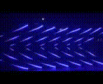

# audioReactiveFadeCandy
This repo uses a python-based code to control LED light strips.  The code "listens to" audio via a microphone or aux cable and then algorithmically generates patterns with the LEDs, reacting to the audio in real-time with a frame rate of 30-60 fps.    

This repo started by cloning https://github.com/scanlime/fadecandy.  
All underlying code that is used to send messages to the lights from the fadecandy controller (opc, fastopc, etc) is not mine.
My additions are the ar, ledWall, bassGuitar, and musicTheory, and basement directories.  

For an in-depth description of how to set up the hardware and how to run a fadecandy server on your machine, see https://learn.adafruit.com/1500-neopixel-led-curtain-with-raspberry-pi-fadecandy/overview.

# Organization
The ar (audio-reactive) directory contains tools and libraries to be used in the implementation of patterns.  
Each project or configuration of lights gets its own directory.  
Each directory should have:  
1. The .json file to configure the server.  
2. Some sort of patterns.py file that contains the patterns as functions.  
3. Some gui or script that implements the patterns.
See the "basement" directory for a typical implementation.  

# How to use
1. Install relevant python libraries (most notably pyaudio, numpy, scipy).  
2. Configure and start the fcserver (see link above).  
3. Plug in an aux cable and make sure that is your default recording device.  
4. Change to the directory where your patterns are implemented (ie "basement") and run the python GUI.   
5. Select the desired pattern in the GUI and the lights should start reacting.   

# Demo
This project has gone through many iterations over the years, but this was probably the most ambitious setup.  This is a 7 foot tall, 21 foot long wall with light strips attached at angles.  It has 16 strips of 64 lights each for a total of 1024 LEDs.  This pattern shown here is pretty simple (all stips doing the same thing), but sometimes the simpler patterns look the cleanest and best.  

